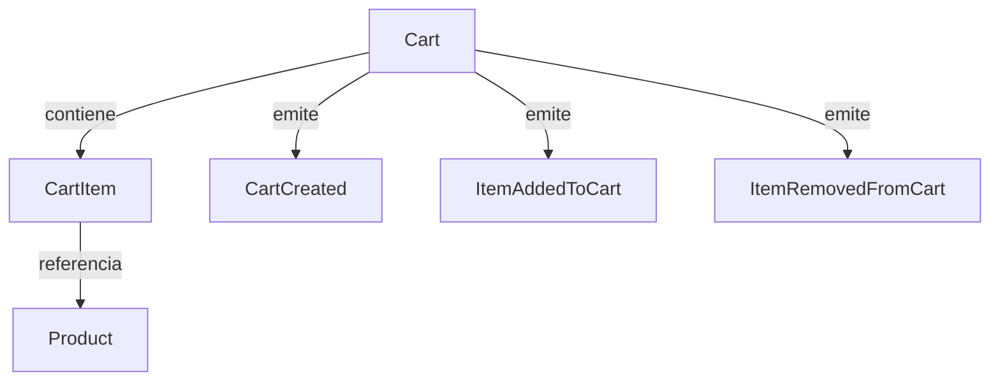
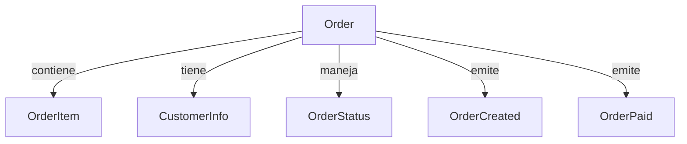

# Siroko Cart & Checkout API 🚀

Una API REST moderna y escalable para gestión de carrito de compras y checkout, diseñada específicamente para el ecosistema e-commerce de Siroko. Construida con **Symfony 6.3** siguiendo principios de **Arquitectura Hexagonal**, **Domain-Driven Design (DDD)** y **CQRS**.

## 📋 Descripción del Proyecto

Sistema desacoplado que permite gestionar carritos de compra de forma **rápida** y **eficiente**, con un proceso de checkout optimizado que genera órdenes persistentes. Diseñado para escalar y evolucionar fácilmente manteniendo la máxima performance.

**Características principales:**
- ⚡ **Performance optimizada** con caché Redis y consultas optimizadas
- 🏗️ **Arquitectura Hexagonal** con dominio completamente desacoplado del framework
- 🎯 **CQRS** para separación clara de responsabilidades
- 📊 **Event-driven** para comunicación entre bounded contexts
- 🧪 **Cobertura exhaustiva** de tests

---

## 🏛️ Modelado del Dominio

### **Cart Bounded Context**


**Entidades:**
- **Cart** (Aggregate Root): Gestiona el ciclo de vida del carrito y mantiene consistencia
- **CartItem**: Representa un producto en el carrito con cantidad específica
- **Product**: Entidad del catálogo con stock y precios

**Value Objects:**
- `CartId`, `ProductId`: Identificadores únicos tipados
- `Money`: Manejo seguro de cantidades monetarias
- `Quantity`: Validación de cantidades de productos

### **Checkout Bounded Context**


**Entidades:**
- **Order** (Aggregate Root): Gestiona el proceso completo de checkout
- **OrderItem**: Item confirmado de la orden
- **CustomerInfo**: Información del cliente

**Value Objects:**
- `OrderId`: Identificador único de orden
- `OrderStatus`: Estados controlados (pending, paid, shipped, cancelled)

---

## 🛠️ Tecnologías Utilizadas

| Categoría | Tecnología | Versión | Propósito |
|-----------|------------|---------|-----------|
| **Backend** | PHP | 8.2+ | Lenguaje principal |
| **Framework** | Symfony | 6.3 | Framework web con DI avanzado |
| **ORM** | Doctrine | 3.x | Mapeo objeto-relacional |
| **Base de Datos** | PostgreSQL | 15 | Persistencia principal |
| **Cache** | Redis | 7.x | Cache de productos y sesiones |
| **Testing** | PHPUnit | 9.6 | Framework de testing |
| **Containerization** | Docker | 24.x | Entorno de desarrollo |
| **Documentation** | OpenAPI | 3.0 | Especificación API |

---

## 🚀 Instrucciones de Instalación

### **Prerrequisitos**
- Docker 24.x+
- Docker Compose 2.x+
- Git

### **Instalación completa**
```bash
# 1. Clonar repositorio
git clone https://github.com/usuario/siroko-cart-api.git
cd siroko-cart-api

# 2. Levantar entorno completo
docker-compose up -d

# 3. Instalar dependencias
docker-compose exec composer install

# 4. Configurar base de datos
docker-compose exec php bin/console doctrine:database:create --if-not-exists
docker-compose exec php bin/console doctrine:migrations:migrate --no-interaction

#5. Verificar instalación
curl http://localhost:8000/api/products
```

**La API estará disponible en:** `http://localhost:8000`

---

## 🧪 Ejecutar Tests

### **Comandos de testing**
```bash
# Tests completos con métricas de performance
docker-compose exec php bin/phpunit

# Solo tests unitarios (dominio puro)
docker-compose exec app php bin/phpunit tests/Unit/

## 📡 OpenAPI Specification

### **Cart Management**

#### **Crear Carrito**
```http
POST /api/carts
Content-Type: application/json

Response 201:
{
  "success": true,
  "data": {
    "cart_id": "01234567-89ab-cdef-0123-456789abcdef"
  }
}
```

#### **Obtener Carrito**
```http
GET /api/carts/{cartId}

Response 200:
{
  "success": true,
  "data": {
    "id": "01234567-89ab-cdef-0123-456789abcdef",
    "items": [
      {
        "product_id": "prod-123",
        "name": "Gafas Siroko Tech",
        "price": 89.99,
        "quantity": 2,
        "subtotal": 179.98
      }
    ],
    "item_count": 2,
    "total": 179.98,
    "created_at": "2024-01-15T10:30:00Z"
  }
}
```

#### **Añadir Producto al Carrito**
```http
POST /api/carts/{cartId}/items
Content-Type: application/json

{
  "product_id": "prod-123",
  "quantity": 2
}

Response 200:
{
  "success": true,
  "message": "Product added to cart successfully"
}
```

#### **Actualizar Cantidad**
```http
PUT /api/carts/{cartId}/items/{productId}
Content-Type: application/json

{
  "quantity": 5
}
```

#### **Eliminar Producto**
```http
DELETE /api/carts/{cartId}/items/{productId}

Response 200:
{
  "success": true,
  "message": "Product removed from cart"
}
```

### **Product Catalog**

#### **Listar Productos**
```http
GET /api/products

Response 200:
{
  "success": true,
  "data": [
    {
      "id": "prod-123",
      "name": "Gafas Siroko Tech",
      "price": 89.99,
      "stock": 50,
      "category": "cycling"
    }
  ]
}
```

### **Checkout Process**

#### **Procesar Checkout**
```http
POST /api/checkout
Content-Type: application/json

{
  "cart_id": "01234567-89ab-cdef-0123-456789abcdef",
  "customer_info": {
    "name": "Juan Pérez",
    "email": "juan@example.com",
    "address": "Calle Mayor 123, Madrid",
    "phone": "+34 612 345 678"
  },
  "payment_method": "stripe"
}

Response 201:
{
  "success": true,
  "data": {
    "order_id": "order-987654321",
    "status": "paid",
    "total": 179.98,
    "created_at": "2024-01-15T10:35:00Z"
  }
}
```

#### **Consultar Orden**
```http
GET /api/orders/{orderId}

Response 200:
{
  "success": true,
  "data": {
    "id": "order-987654321",
    "status": "paid",
    "customer_info": {
      "name": "Juan Pérez",
      "email": "juan@example.com"
    },
    "items": [...],
    "total": 179.98,
    "created_at": "2024-01-15T10:35:00Z"
  }
}
```

---

## 🏗️ Arquitectura y Patrones

### **Arquitectura Hexagonal**
```
┌─────────────────────────────────────────────────────────────────┐
│                    INFRASTRUCTURE LAYER                        │
├─────────────────┬─────────────────┬─────────────────────────────┤
│   Controllers   │   Repositories  │   External Services         │
│   (HTTP Input)  │   (Database)    │   (Payment, Email, etc.)    │
│   - CartCtrl    │   - DoctrineRepo│   - StripePayment           │
│   - CheckoutCtrl│   - RedisCache  │   - EmailService            │
└─────────────────┼─────────────────┼─────────────────────────────┘
         │                 │                     │
         ▼                 ▼                     ▼
┌─────────────────────────────────────────────────────────────────┐
│                    APPLICATION LAYER                           │
├─────────────────┬─────────────────┬─────────────────────────────┤
│   Commands      │   Queries       │   Ports (Interfaces)       │
│   (Write)       │   (Read)        │   - CartRepositoryInterface │
│   - AddItemCmd  │   - GetCartQry  │   - PaymentServiceInterface │
│   - CheckoutCmd │   - GetOrderQry │   - EventBusInterface       │
└─────────────────┼─────────────────┼─────────────────────────────┘
         │                 │                     │
         ▼                 ▼                     ▼
┌─────────────────────────────────────────────────────────────────┐
│                      DOMAIN LAYER                              │
├─────────────────┬─────────────────┬─────────────────────────────┤
│   Entities      │   Value Objects │   Domain Events             │
│   (Aggregates)  │   (Immutable)   │   (Business Events)         │
│   - Cart        │   - Money       │   - CartCreated             │
│   - Order       │   - CartId      │   - ItemAdded               │
│   - Product     │   - Quantity    │   - OrderPlaced             │
└─────────────────┴─────────────────┴─────────────────────────────┘
```

### **CQRS Implementation**
- **Commands**: Modifican estado (AddItemToCart, ProcessCheckout)
- **Queries**: Solo lectura (GetCart, GetProducts)
- **Handlers**: Lógica de aplicación desacoplada
- **Events**: Comunicación asíncrona entre contextos

---
