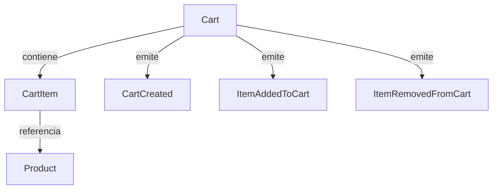
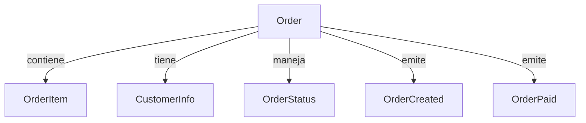

# Siroko Cart & Checkout API 🚀

## 📋 Descripción del Proyecto

Sistema desacoplado que permite gestionar carritos de compra de forma **rápida** y **eficiente**, con un proceso de checkout optimizado que genera órdenes persistentes. Diseñado para escalar y evolucionar fácilmente manteniendo la máxima performance.

**Características principales:**
- ⚡ **Performance optimizada** con caché Redis y consultas optimizadas
- 🏗️ **Arquitectura Hexagonal** con dominio completamente desacoplado del framework
- 🎯 **CQRS** para separación clara de responsabilidades
- 📊 **Event-driven** para comunicación entre bounded contexts
- 🧪 **Cobertura exhaustiva** de tests
- 🔄 **Time to market** optimizado con evolución continua

---

## 🗄️ Estructura de Base de Datos

### **Schema de tablas principales**

#### **Carts (Carritos)**
```sql
CREATE TABLE carts (
    id VARCHAR(36) NOT NULL PRIMARY KEY,        -- CartId (custom type)
    created_at TIMESTAMP NOT NULL,
    INDEX IDX_carts_created_at (created_at)
);
```

#### **Cart Items (Items del carrito)**
```sql
CREATE TABLE cart_items (
    id UUID PRIMARY KEY,                        -- UUID auto-generated
    cart_id VARCHAR(36) NOT NULL,               -- CartId (custom type)
    product_id VARCHAR(255) NOT NULL,           -- ProductId (custom type)
    product_name VARCHAR(255) NOT NULL,
    unit_price VARCHAR(255) NOT NULL,           -- Money (custom type: "8999:EUR")
    quantity INTEGER NOT NULL,                  -- Quantity (custom type)
    FOREIGN KEY (cart_id) REFERENCES carts(id) ON DELETE CASCADE
);
```

#### **Products (Catálogo de productos)**
```sql
CREATE TABLE products (
    id VARCHAR(255) NOT NULL PRIMARY KEY,       -- ProductId (custom type)
    name VARCHAR(255) NOT NULL,
    description TEXT,
    price VARCHAR(255) NOT NULL,                -- Money (custom type: "8999:EUR")
    stock INTEGER NOT NULL DEFAULT 0,
    active BOOLEAN NOT NULL DEFAULT true
);
```

#### **Orders (Órdenes de compra)**
```sql
CREATE TABLE orders (
    id VARCHAR(36) NOT NULL PRIMARY KEY,        -- OrderId (custom type)
    status VARCHAR(20) NOT NULL DEFAULT 'pending',
    
    -- CustomerInfo (embeddable value object)
    email VARCHAR(255) NOT NULL,
    first_name VARCHAR(255) NOT NULL,
    last_name VARCHAR(255) NOT NULL,
    address VARCHAR(255) NOT NULL,
    city VARCHAR(255) NOT NULL,
    postal_code VARCHAR(20) NOT NULL,
    country VARCHAR(100) NOT NULL,
    
    total_amount VARCHAR(255) NOT NULL,         -- Money (custom type)
    created_at TIMESTAMP NOT NULL,
    updated_at TIMESTAMP NOT NULL
);
```

#### **Order Items (Items de la orden)**
```sql
CREATE TABLE order_items (
    id UUID PRIMARY KEY,                        -- UUID auto-generated
    order_id VARCHAR(36) NOT NULL,              -- OrderId (custom type)
    product_id VARCHAR(255) NOT NULL,           -- ProductId (custom type)
    product_name VARCHAR(255) NOT NULL,
    quantity INTEGER NOT NULL,                  -- Quantity (custom type)
    unit_price VARCHAR(255) NOT NULL,           -- Money (custom type)
    subtotal VARCHAR(255) NOT NULL,             -- Money (custom type)
    FOREIGN KEY (order_id) REFERENCES orders(id) ON DELETE CASCADE
);
```#### **Cart Items (Items del carrito)**
```sql
CREATE TABLE cart_items (
    id UUID PRIMARY KEY,                        -- UUID auto-generated
    cart_id VARCHAR(36) NOT NULL,               -- CartId (custom type)
    product_id VARCHAR(255) NOT NULL,           -- ProductId (custom type)
    product_name VARCHAR(255) NOT NULL,
    unit_price VARCHAR(255) NOT NULL,           -- Money (custom type: "8999:EUR")
    quantity INTEGER NOT NULL,                  -- Quantity (custom type)
    FOREIGN KEY (cart_id) REFERENCES carts(id) ON DELETE CASCADE
);
```

#### **Products (Catálogo de productos)**
```sql
CREATE TABLE products (
    id VARCHAR(255) NOT NULL PRIMARY KEY,       -- ProductId (custom type)
    name VARCHAR(255) NOT NULL,
    description TEXT,
    price VARCHAR(255) NOT NULL,                -- Money (custom type: "8999:EUR")
    stock INTEGER NOT NULL DEFAULT 0,
    active BOOLEAN NOT NULL DEFAULT true
);
```

#### **Orders (Órdenes de compra)**
```sql
CREATE TABLE orders (
    id VARCHAR(36) NOT NULL PRIMARY KEY,        -- OrderId (custom type)
    status VARCHAR(20) NOT NULL DEFAULT 'pending',
    
    -- CustomerInfo (embeddable value object)
    email VARCHAR(255) NOT NULL,
    first_name VARCHAR(255) NOT NULL,
    last_name VARCHAR(255) NOT NULL,
    address VARCHAR(255) NOT NULL,
    city VARCHAR(255) NOT NULL,
    postal_code VARCHAR(20) NOT NULL,
    country VARCHAR(100) NOT NULL,
    
    total_amount VARCHAR(255) NOT NULL,         -- Money (custom type)
    created_at TIMESTAMP NOT NULL,
    updated_at TIMESTAMP NOT NULL
);
```

#### **Order Items (Items de la orden)**
```sql
CREATE TABLE order_items (
    id UUID PRIMARY KEY,                        -- UUID auto-generated
    order_id VARCHAR(36) NOT NULL,              -- OrderId (custom type)
    product_id VARCHAR(255) NOT NULL,           -- ProductId (custom type)
    product_name VARCHAR(255) NOT NULL,
    quantity INTEGER NOT NULL,                  -- Quantity (custom type)
    unit_price VARCHAR(255) NOT NULL,           -- Money (custom type)
    subtotal VARCHAR(255) NOT NULL,             -- Money (custom type)
    FOREIGN KEY (order_id) REFERENCES orders(id) ON DELETE CASCADE
);
```

### **🏗️ Características de Diseño DDD**

#### **Custom Doctrine Types**
- **`cart_id`**: CartId value object
- **`product_id`**: ProductId value object  
- **`money`**: Money value object (formato: "8999:EUR")
- **`quantity`**: Quantity value object con validaciones

#### **Embeddable Value Objects**
- **`CustomerInfo`**: Información del cliente embebida en orders
- **Validaciones**: Email, códigos postales, constraints de negocio

#### **Aggregate Boundaries**
- **Cart + CartItems**: Un agregado para consistencia transaccional
- **Order + OrderItems**: Otro agregado independiente
- **Product**: Agregado simple del catálogo

### **Comandos de base de datos**

```bash
# Ver estado de migraciones
docker-compose exec php bin/console doctrine:migrations:status

# Ejecutar script SQL completo
docker-compose exec php bin/console dbal:run-sql "$(cat database/setup.sql)"

# Ver esquema actual
docker-compose exec php bin/console doctrine:schema:validate

# Ver tablas existentes (PostgreSQL)
docker-compose exec php bin/console dbal:run-sql "SELECT tablename FROM pg_tables WHERE schemaname = 'public';"

# Describir estructura de tabla específica (PostgreSQL)
docker-compose exec php bin/console dbal:run-sql "SELECT column_name, data_type, is_nullable FROM information_schema.columns WHERE table_name = 'products';"

# Ver productos cargados
docker-compose exec php bin/console dbal:run-sql "SELECT id, name, price, stock FROM products WHERE active = true LIMIT 5;"

# Ver carritos activos
docker-compose exec php bin/console dbal:run-sql "SELECT * FROM active_carts;"

# Ver productos con stock bajo
docker-compose exec php bin/console dbal:run-sql "SELECT * FROM low_stock_products;"
```

---

## 📚 Documentación Adicional

### **Ejemplos de uso completos**

```bash
# 1. Crear un carrito
CART_RESPONSE=$(curl -s -X POST http://localhost:8000/api/carts)
CART_ID=$(echo $CART_RESPONSE | jq -r '.data.cart_id')

# 2. Obtener productos disponibles
curl -s http://localhost:8000/api/products | jq '.'

# 3. Añadir producto al carrito
curl -X POST http://localhost:8000/api/carts/$CART_ID/items \
  -H "Content-Type: application/json" \
  -d '{"product_id":"prod-123","quantity":2}'

# 4. Ver carrito actualizado
curl -s http://localhost:8000/api/carts/$CART_ID | jq '.'

# 5. Procesar checkout
curl -X POST http://localhost:8000/api/checkout \
  -H "Content-Type: application/json" \
  -d '{
    "cart_id": "'$CART_ID'",
    "customer_info": {
      "name": "Juan Pérez",
      "email": "juan@example.com",
      "address": "Calle Mayor 123, Madrid"
    },
    "payment_method": "stripe"
  }'
```

### **Scripts de testing automático**

```bash
# Ejecutar secuencia completa de testing
make test-api

# O manualmente:
chmod +x scripts/test-api.sh
./scripts/test-api.sh
```

---

## 🏛️ Modelado del Dominio

### **Cart Bounded Context**


**Entidades:**
- **Cart** (Aggregate Root): Gestiona el ciclo de vida del carrito y mantiene consistencia
- **CartItem**: Representa un producto en el carrito con cantidad específica
- **Product**: Entidad del catálogo con stock y precios

**Value Objects:**
- `CartId`, `ProductId`: Identificadores únicos tipados
- `Money`: Manejo seguro de cantidades monetarias
- `Quantity`: Validación de cantidades de productos

### **Checkout Bounded Context**


**Entidades:**
- **Order** (Aggregate Root): Gestiona el proceso completo de checkout
- **OrderItem**: Item confirmado de la orden
- **CustomerInfo**: Información del cliente

**Value Objects:**
- `OrderId`: Identificador único de orden
- `OrderStatus`: Estados controlados (pending, paid, shipped, cancelled)

---

## 🛠️ Tecnologías Utilizadas

| Categoría | Tecnología | Versión | Propósito |
|-----------|------------|---------|-----------|
| **Backend** | PHP | 8.2+ | Lenguaje principal |
| **Framework** | Symfony | 6.3 | Framework web con DI avanzado |
| **ORM** | Doctrine | 3.x | Mapeo objeto-relacional |
| **Base de Datos** | PostgreSQL | 15 | Persistencia principal |
| **Cache** | Redis | 7.x | Cache de productos y sesiones |
| **Testing** | PHPUnit | 9.6 | Framework de testing |
| **Containerization** | Docker | 24.x | Entorno de desarrollo |
| **Documentation** | OpenAPI | 3.0 | Especificación API |

---

## 🚀 Instrucciones de Instalación

### **Prerrequisitos**
- Docker 24.x+
- Docker Compose 2.x+
- Git

### **Instalación completa**
```bash
# 1. Clonar repositorio
git clone https://github.com/usuario/siroko-cart-api.git
cd siroko-cart-api

# 2. Levantar entorno completo
docker-compose up -d

# 3. Instalar dependencias
docker-compose exec app composer install

# 4. Configurar base de datos completa
docker-compose exec app php bin/console doctrine:database:create --if-not-exists

# Ejecutar script SQL completo (crea todas las tablas y datos)
docker-compose exec app php bin/console dbal:run-sql "$(cat database/setup.sql)"

# 5. Verificar instalación
docker-compose exec app php bin/console dbal:run-sql "SELECT id, name, price_amount/100 as price_eur, stock FROM product LIMIT 5;"

# 6. Verificar instalación
curl http://localhost:8080/api/products
```

**La API estará disponible en:** `http://localhost:8000`

> **Nota:** Si tienes conflictos de puerto, la aplicación también funciona en `http://localhost:8080` modificando docker-compose.yml

---

## 🧪 Ejecutar Tests

### **Comandos de testing**
```bash
# Tests completos con métricas de performance
docker-compose exec app php bin/phpunit

# Solo tests unitarios (dominio puro)
docker-compose exec app php bin/phpunit tests/Unit/

```

### **Métricas de Calidad**
- **Cobertura de código:** >95%
- **Tests unitarios:** ~40 tests
- **Tests de integración:** ~15 tests
- **Tiempo de ejecución:** <3 segundos

---

## 📡 OpenAPI Specification

## 📡 OpenAPI Specification

### **📁 Especificación completa**
**Archivo:** [`docs/openapi.yaml`](./docs/openapi.yaml)

### **🧪 Cómo probar la API (3 opciones):**

#### **Opción 1: Swagger Editor (Recomendado)**
1. Ve a [editor.swagger.io](https://editor.swagger.io/)
2. File → Import file → Selecciona `docs/openapi.yaml`
3. ¡Probar endpoints directamente desde el navegador!

#### **Opción 2: Postman**
1. Import → Upload file → `docs/openapi.yaml`
2. Se crea automáticamente la colección completa

#### **Opción 3: cURL directo**
```bash
# Crear carrito
curl -X POST http://localhost:8000/api/carts

# Obtener carrito
curl http://localhost:8000/api/carts/{cartId}

# Añadir producto
curl -X POST http://localhost:8000/api/carts/{cartId}/items \
  -H "Content-Type: application/json" \
  -d '{"product_id":"prod-123","quantity":2}'
```

### **Endpoints Principales**

#### **Cart Management**

#### **Crear Carrito**
```http
POST /api/carts
Content-Type: application/json

Response 201:
{
  "success": true,
  "data": {
    "cart_id": "01234567-89ab-cdef-0123-456789abcdef"
  }
}
```

#### **Obtener Carrito**
```http
GET /api/carts/{cartId}

Response 200:
{
  "success": true,
  "data": {
    "id": "01234567-89ab-cdef-0123-456789abcdef",
    "items": [
      {
        "product_id": "prod-123",
        "name": "Gafas Siroko Tech",
        "price": 89.99,
        "quantity": 2,
        "subtotal": 179.98
      }
    ],
    "item_count": 2,
    "total": 179.98,
    "created_at": "2024-01-15T10:30:00Z"
  }
}
```

#### **Añadir Producto al Carrito**
```http
POST /api/carts/{cartId}/items
Content-Type: application/json

{
  "product_id": "prod-123",
  "quantity": 2
}

Response 200:
{
  "success": true,
  "message": "Product added to cart successfully"
}
```

#### **Actualizar Cantidad**
```http
PUT /api/carts/{cartId}/items/{productId}
Content-Type: application/json

{
  "quantity": 5
}
```

#### **Eliminar Producto**
```http
DELETE /api/carts/{cartId}/items/{productId}

Response 200:
{
  "success": true,
  "message": "Product removed from cart"
}
```

### **Product Catalog**

#### **Listar Productos**
```http
GET /api/products

Response 200:
{
  "success": true,
  "data": [
    {
      "id": "prod-123",
      "name": "Gafas Siroko Tech",
      "price": 89.99,
      "stock": 50,
      "category": "cycling"
    }
  ]
}
```

### **Checkout Process**

#### **Procesar Checkout**
```http
POST /api/checkout
Content-Type: application/json

{
  "cart_id": "01234567-89ab-cdef-0123-456789abcdef",
  "customer_info": {
    "name": "Juan Pérez",
    "email": "juan@example.com",
    "address": "Calle Mayor 123, Madrid",
    "phone": "+34 612 345 678"
  },
  "payment_method": "stripe"
}

Response 201:
{
  "success": true,
  "data": {
    "order_id": "order-987654321",
    "status": "paid",
    "total": 179.98,
    "created_at": "2024-01-15T10:35:00Z"
  }
}
```

#### **Consultar Orden**
```http
GET /api/orders/{orderId}

Response 200:
{
  "success": true,
  "data": {
    "id": "order-987654321",
    "status": "paid",
    "customer_info": {
      "name": "Juan Pérez",
      "email": "juan@example.com"
    },
    "items": [...],
    "total": 179.98,
    "created_at": "2024-01-15T10:35:00Z"
  }
}
```

---

## 🏗️ Arquitectura y Patrones

### **Arquitectura Hexagonal**
```
┌─────────────────────────────────────────────────────────────────┐
│                    INFRASTRUCTURE LAYER                        │
├─────────────────┬─────────────────┬─────────────────────────────┤
│   Controllers   │   Repositories  │   External Services         │
│   (HTTP Input)  │   (Database)    │   (Payment, Email, etc.)    │
│   - CartCtrl    │   - DoctrineRepo│   - StripePayment           │
│   - CheckoutCtrl│   - RedisCache  │   - EmailService            │
└─────────────────┼─────────────────┼─────────────────────────────┘
         │                 │                     │
         ▼                 ▼                     ▼
┌─────────────────────────────────────────────────────────────────┐
│                    APPLICATION LAYER                           │
├─────────────────┬─────────────────┬─────────────────────────────┤
│   Commands      │   Queries       │   Ports (Interfaces)       │
│   (Write)       │   (Read)        │   - CartRepositoryInterface │
│   - AddItemCmd  │   - GetCartQry  │   - PaymentServiceInterface │
│   - CheckoutCmd │   - GetOrderQry │   - EventBusInterface       │
└─────────────────┼─────────────────┼─────────────────────────────┘
         │                 │                     │
         ▼                 ▼                     ▼
┌─────────────────────────────────────────────────────────────────┐
│                      DOMAIN LAYER                              │
├─────────────────┬─────────────────┬─────────────────────────────┤
│   Entities      │   Value Objects │   Domain Events             │
│   (Aggregates)  │   (Immutable)   │   (Business Events)         │
│   - Cart        │   - Money       │   - CartCreated             │
│   - Order       │   - CartId      │   - ItemAdded               │
│   - Product     │   - Quantity    │   - OrderPlaced             │
└─────────────────┴─────────────────┴─────────────────────────────┘
```

**Principios clave:**
- **Domain** no conoce Infrastructure
- **Application** orquesta casos de uso
- **Infrastructure** implementa Ports del dominio
- **Dependencias apuntan hacia adentro** (Dependency Inversion)

### **CQRS Implementation**
- **Commands**: Modifican estado (AddItemToCart, ProcessCheckout)
- **Queries**: Solo lectura (GetCart, GetProducts)
- **Handlers**: Lógica de aplicación desacoplada
- **Events**: Comunicación asíncrona entre contextos

### **Performance Optimizations**
- **Redis Cache**: Productos y metadatos del carrito
- **Doctrine Query Optimization**: Eager loading estratégico
- **Database Indexing**: Índices optimizados para consultas frecuentes
- **DTO Serialization**: Respuestas optimizadas

---

## 🚀 Roadmap y Escalabilidad

### **Próximas funcionalidades**
- [ ] **Autenticación JWT** para carritos personalizados
- [ ] **Rate limiting** avanzado por IP/usuario
- [ ] **Microservicios** separation (Inventory, Payment, Notification)
- [ ] **Multi-tenant** support para white-label

---